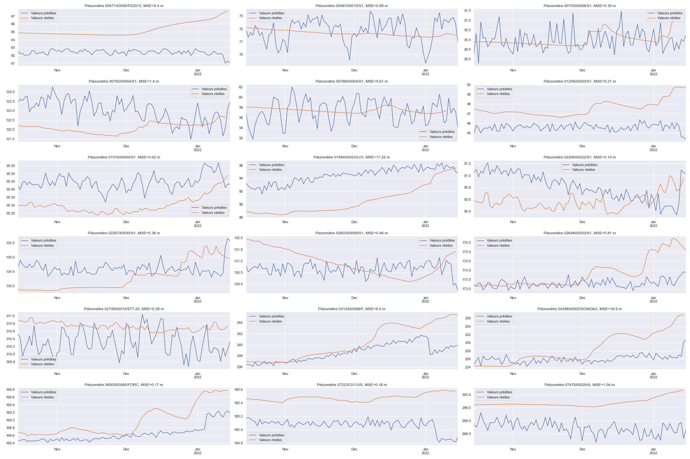

# Défi EGC 2022 : prévoir l’évolution du niveau de nos nappes phréatiques

https://www.egc.asso.fr/manifestations/defi-egc/defi-egc-2022-prevoir-levolution-du-niveau-de-nos-nappes-phreatiques.html

## Notre système de prévision


## Nos prédictions du 15 oct. 2021 au 15 jan. 2022



### Cartographie de nos modèles


Nous identifions deux clusteurs assez bien délimités pour les modèles LSTM et CONV respectivement, et un cluster entre les deux pour le modèle RESNET. 

## Dépendances:

- Python3
- Tensorflow 2
- Pandas
- Requests

## Refaire les prévisions
Executez le fichier `defi1-final.py` afin de relancer les prédictions. Le script téléchargera les données les plus récentes disponibles sur l'API [Piézométrique](https://hubeau.eaufrance.fr/page/api-piezometrie) pour l'apprentissage et l'évaluation des modèles. Les performances seront sauvegardées dans le fichier `performances.csv` et les prévisions dans `submission.csv`.


```
usage: defi1-final.py [-h] [-e MAX_EPOCH] [-b BATCH_SIZE] [-p PATIENCE]
                      [-v VERBOSE]

optional arguments:
  -h, --help            show this help message and exit
  -e MAX_EPOCH, --max_epoch MAX_EPOCH
                        Maximum number of epochs
  -b BATCH_SIZE, --batch_size BATCH_SIZE
                        Batch size
  -p PATIENCE, --patience PATIENCE
                        The patience value for early stopping callback
  -v VERBOSE, --verbose VERBOSE
                        The verbosing level for keras
```
